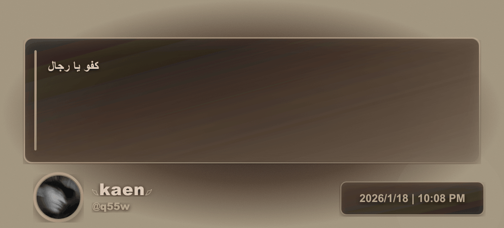
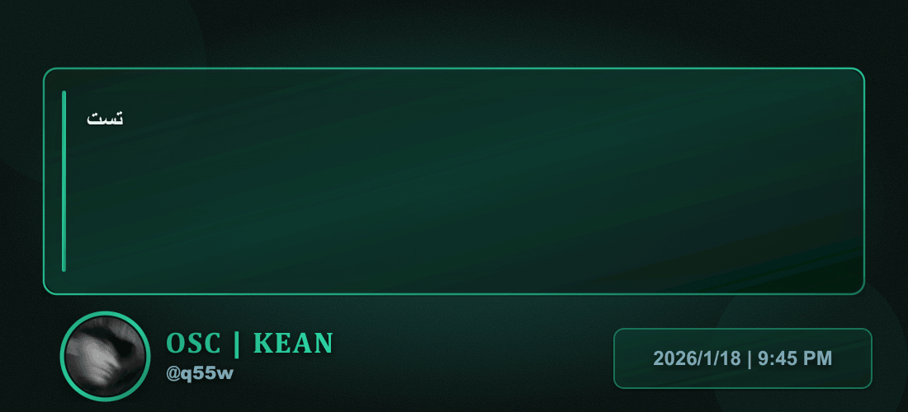

# بوت بطاقات الاقتباسات - Discord Quote Bot

بوت ديسكورد يقوم بتحويل الرسائل النصية إلى بطاقات اقتباسات مصممة بشكل احترافي.

## المتطلبات

- Node.js (الإصدار 16.9.0 أو أحدث)
- حساب Discord Developer
- توكن بوت Discord

## خطوات التثبيت

### 1. تحميل المشروع

```bash
# إنشاء مجلد جديد للمشروع
mkdir discord-quote-bot
cd discord-quote-bot
```

### 2. إنشاء هيكل المشروع

قم بإنشاء الملفات والمجلدات التالية:

```
discord-quote-bot/
├── index.js
├── package.json
├── config/
│   └── config.js
└── images/               # <- ضع الصور التوضيحية هنا
```

### 3. تثبيت المكتبات

```bash
npm install
```

### 4. الحصول على توكن البوت

1. اذهب إلى https://discord.com/developers/applications
2. اضغط على "New Application"
3. اكتب اسمًا للبوت ثم "Create"
4. من القائمة الجانبية → "Bot" → "Add Bot"
5. اضغط "Reset Token" ثم انسخ التوكن
6. **مهم جدًا:** فعّل الـ Intents التالية في قسم "Privileged Gateway Intents":
   - PRESENCE INTENT
   - SERVER MEMBERS INTENT
   - MESSAGE CONTENT INTENT

### 5. إضافة البوت إلى السيرفر

1. من القائمة الجانبية → "OAuth2" → "URL Generator"
2. في SCOPES: اختر bot
3. في BOT PERMISSIONS: اختر
   - Send Messages
   - Attach Files
   - Read Message History
   - View Channels
4. انسخ الرابط واستخدمه لإضافة البوت إلى سيرفرك

### 6. إعداد ملف config.js

```javascript
module.exports = {
  token: 'ضع_توكن_البوت_هنا',
  quoteChannelId: '1458263533929369786',   // معرف القناة
  // ... باقي الإعدادات
};
```

#### كيف تحصل على معرف القناة؟
- فعّل Developer Mode (الإعدادات → Advanced)
- كليك يمين على القناة → Copy Channel ID

## تشغيل البوت

```bash
# التشغيل العادي
npm start

# أو للتطوير (إعادة تشغيل تلقائي عند التعديل)
npm run dev
```

## تخصيص الإعدادات

### تغيير حالة البوت

```javascript
botStatus: {
  activity: 'إنشاء بطاقات الاقتباسات',
  type: 'Playing',
  status: 'online'
}
```

### تغيير الألوان (أمثلة)

ثيم أخضر مائي (الافتراضي):
```javascript
accentPrimary: '#21ad82',
backgroundGradient: { start: '#0d4036', middle: '#062420', end: '#020d0a' }
```

ثيم أزرق:
```javascript
accentPrimary: '#2196F3',
backgroundGradient: { start: '#1565C0', middle: '#0D47A1', end: '#01579B' }
```

ثيم أرجواني:
```javascript
accentPrimary: '#9C27B0',
backgroundGradient: { start: '#7B1FA2', middle: '#6A1B9A', end: '#4A148C' }
```

ثيم ذهبي:
```javascript
accentPrimary: '#FFC107',
backgroundGradient: { start: '#F57C00', middle: '#E65100', end: '#BF360C' }
```

### إعدادات الصورة والنص

```javascript
imageSettings: {
  width: 1100,
  height: 500,
  maxCharsPerLine: 60,
  maxLines: 4
}
```

### المنطقة الزمنية

```javascript
timezone: 'Africa/Cairo'   // مثال: مصر
// أخرى: Asia/Riyadh , Asia/Dubai , Asia/Baghdad ...
```



<!-- أو رابط مباشر إذا كانت على الإنترنت: https://i.imgur.com/xxxxxx.png -->

**مثال 2 – ثيم أرجواني أنيق**



**مثال 3 – ثيم ذهبي فاخر**


## كيفية الاستخدام

1. اذهب إلى القناة المحددة في config.js
2. اكتب أي نص عادي
3. البوت سيقوم تلقائيًا بإنشاء بطاقة الاقتباس وإرسالها

## حل المشاكل الشائعة

- البوت لا يرد → تأكد من التوكن + الـ Intents + معرف القناة
- الصورة لا تُرسل → تحقق من صلاحية "Attach Files"
- الألوان لا تتغير → أعد تشغيل البوت بعد التعديل

## المكتبات المستخدمة

- discord.js
- sharp
- node-fetch

## الترخيص

MIT License

## ملاحظات

- يدعم النصوص فقط (بدون صور مرفقة حاليًا)
- الرسائل الطويلة جدًا تُقصّر تلقائيًا
- مناسب للتشغيل على Railway / Render / VPS

